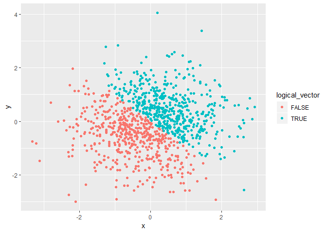
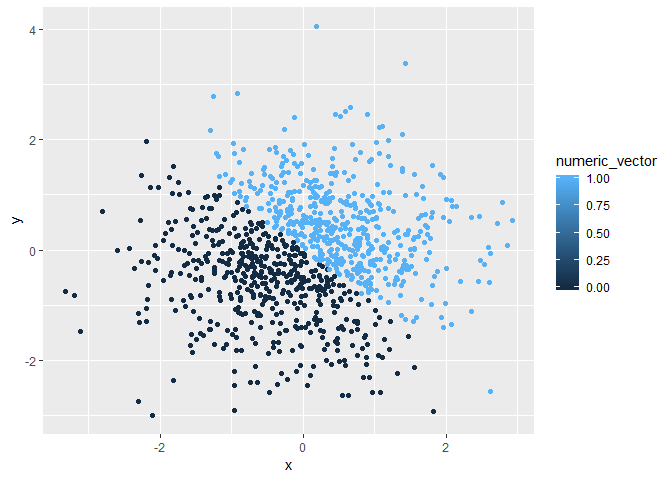
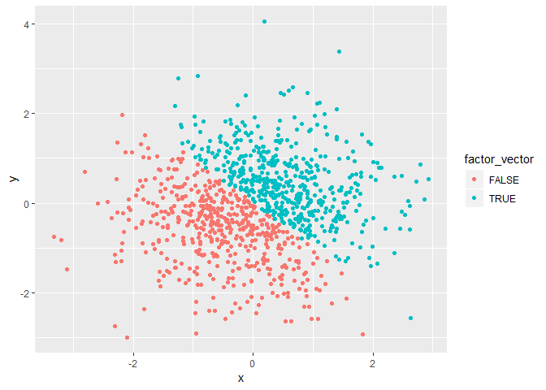

p8105 - Homework 1
================
Jie Yu
2018-09-15

-   [Problem 1](#problem-1)
    -   [Data Frame](#data-frame)
    -   [Mean of each variable](#mean-of-each-variable)
    -   [Convert variables](#convert-variables)
-   [Problem 2](#problem-2)
    -   [Data Frame](#data-frame-1)
    -   [Description of vectors](#description-of-vectors)
    -   [Scatterplots](#scatterplots)

Problem 1
=========

### Data Frame

The chunk below creates a data frame containing:

-   A random sample of size 10 from a uniform\[0, 5\] distribution
-   A logical vector indicating whether elements of the sample are greater than 2
-   A (length-10) character vector
-   A (length-10) factor vector

``` r
# Set seed to ensure reproducibility
set.seed(123)  

# Create a data frame of 4 variables
p1_df = tibble(
  unif_samp = runif(10, min = 0, max = 5),
  vec_logical = unif_samp >= 2, 
  vec_char = c("I", "am", "glad", "to", "be", "here", "Wishing", "you", "happiness", "always"),
  vec_factor = factor(c("male", "male", "female", "female", "male", "female", "female", "male", "female", "female"))
)
```

### Mean of each variable

-   The mean of variable `unif_samp` is 2.8912375
-   The mean of variable `vec_logical` is 0.8
-   The mean of variable `vec_char` is NA
-   The mean of variable `vec_factor` is NA

We successfully get the mean of variables `unif_samp` and `vec_logical`, but we does not get the mean of variables `vec_char` and `vec_factor`. That is because we cannot calculate the mean of character and factor variables.

### Convert variables

The chunk below applies the `as.numeric` function to the logical, character, and factor variables.

``` r
as.numeric(p1_df$vec_logical)
as.numeric(p1_df$vec_character)
as.numeric(p1_df$vec_factor)
```

The scripts above convert the logical, character, and factor variables from their original types to numeric.

Then we use the following chunk to convert the character variable from character to factor to numeric; similarly, convert the factor variable from factor to character to numeric.

``` r
# Convert the character variable to facter, then to numeric
as.numeric(factor(p1_df$vec_char))   
```

    ##  [1]  7  2  4  8  3  6  9 10  5  1

``` r
# Convert the factor variable to character, then to numeric
as.numeric(as.character(p1_df$vec_factor))
```

    ## Warning: NAs introduced by coercion

    ##  [1] NA NA NA NA NA NA NA NA NA NA

We find that the first conversion succeeds, and outputs a sequence of numbers corresponding to the alphabetical order of the original character variables.

However, the second conversion outputs a sequence of NA values. From this experiment, We learn that character variable cannot be converted from character to numeric directly. It should be first converted to factor, and then to numeric.

Problem 2
=========

### Data Frame

The chunk below creates a data frame for plotting, which comprises of:

-   x: a random sample of size 1000 from a standard Normal distribution
-   y: a random sample of size 1000 from a standard Normal distribution
-   A logical vector indicating whether the x + y &gt; 0
-   A numeric vector created by coercing the above logical vector
-   A factor vector created by coercing the above logical vector

``` r
# Set seed to ensure reproducibility
set.seed(111)  

# Create a data frame of 5 variables
p2_df = tibble(
  x = rnorm(1000, mean = 0, sd = 1),
  y = rnorm(1000, mean = 0, sd = 1),
  logical_vector = x + y > 0, 
  numeric_vector = as.numeric(logical_vector),
  factor_vector = as.factor(logical_vector)
)
```

### Description of vectors

-   The size of the dataset is 1000 rows, and 5 columns.
-   The mean of x is 0.0108092, and median of x is 0.0196749.
-   The proportion of cases for which the logical vector is `TRUE` is 0.505

### Scatterplots

Now we present a couple of scatterplots by using different variables as color points.

First, we show a scatterplot of `y` vs `x` by using the logical variable as color points.

``` r
ggplot(p2_df, aes(x = x, y = y, color = logical_vector)) + geom_point()
```



``` r
# Export my first scatterplot to my project directory
ggsave("scatter_logical.pdf")
```

    ## Saving 7 x 5 in image

Next, we show a scatterplot of `y` vs `x` by using the numeric variable as color points.

``` r
ggplot(p2_df, aes(x = x, y = y, color = numeric_vector)) + geom_point()
```



Then, we show a scatterplot of `y` vs `x` by using the factor variable as color points.

``` r
ggplot(p2_df, aes(x = x, y = y, color = factor_vector)) + geom_point()
```



We can see that there are only two seperate colors in the color scale of the first and third scatterplots, because logical and factor variables are categorical variables.

In contrast, there are color gradient in the color scale of the second scatterplot, because numeric variable is viewed as continuous variable by default.
